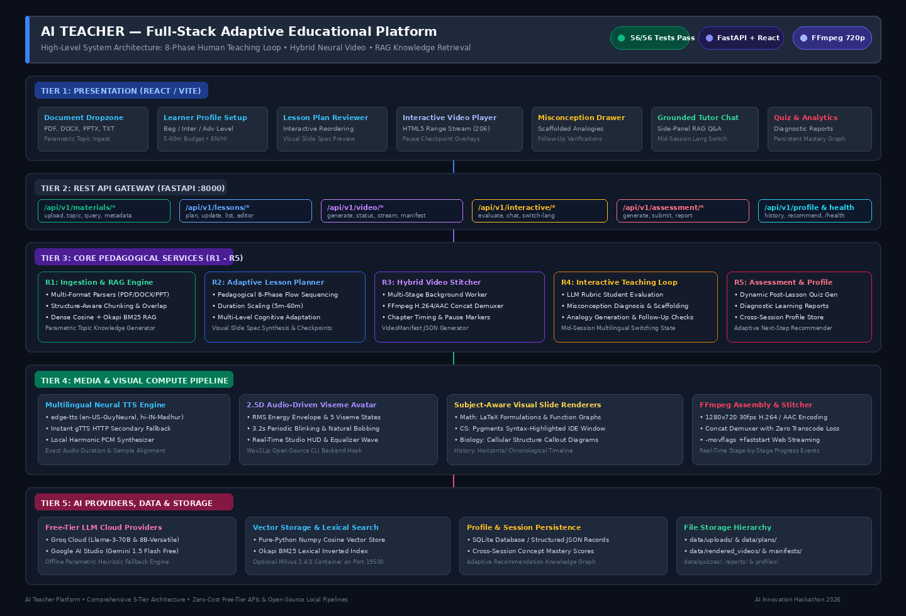

# 🎓 AI Teacher — Full-Stack Adaptive Educational Platform

[](README.md)
[-blue.svg)](TEST_READY.md)
[](https://www.python.org/)
[](frontend/)
[](backend/)
[](docs/architecture.md#hybrid-video-generation-pipeline-r3)
[](LICENSE)

An intelligent, full-stack educational web application built for the **AI Innovation Hackathon 2026**. AI Teacher ingests uploaded course materials (PDF, DOCX, PPTX, TXT) or free-form topics and delivers personalized, adaptive, multilingual lessons through a **hybrid neural video experience** — executing the authentic human teaching loop:

$$\text{\bf Understand} \longrightarrow \text{\bf Plan} \longrightarrow \text{\bf Explain} \longrightarrow \text{\bf Demonstrate} \longrightarrow \text{\bf Question} \longrightarrow \text{\bf Evaluate} \longrightarrow \text{\bf Adapt} \longrightarrow \text{\bf Continue}$$

---

## 📑 Table of Contents

- [Key Innovations & Highlights](#key-innovations-highlights)
- [The 8-Phase Human Teaching Loop](#the-8-phase-human-teaching-loop)
- [Core Features (Milestones R1–R5)](#core-features-milestones-r1r5)
  - [R1: Learning Material Ingestion & RAG](#r1-learning-material-ingestion-rag)
  - [R2: Personalized Lesson Planning](#r2-personalized-lesson-planning)
  - [R3: Hybrid Neural Video Pipeline](#r3-hybrid-neural-video-pipeline)
  - [R4: Interactive & Adaptive Teaching Loop](#r4-interactive-adaptive-teaching-loop)
  - [R5: Assessment & Persistent Learning Profile](#r5-assessment-persistent-learning-profile)
- [System Architecture](#system-architecture)
- [Technology Stack](#technology-stack)
- [Quick Start Guide](#quick-start-guide)
  - [Option A: Single-Command Launch (`./run.sh`)](#option-a-single-command-launch-runsh)
  - [Option B: Multi-Container Docker Compose](#option-b-multi-container-docker-compose)
  - [Option C: Manual Local Development](#option-c-manual-local-development)
- [Generating Demo Videos (>= 2 Minutes)](#generating-demo-videos-2-minutes)
- [Testing & Quality Assurance](#testing-quality-assurance)
- [Comprehensive Documentation Hub](#comprehensive-documentation-hub)
- [License & Acknowledgments](#license-acknowledgments)

---

## 🌟 Key Innovations & Highlights

1. **Hybrid Video Architecture**: Unlike monolithic avatar videos, AI Teacher uses a **hybrid approach**:
   - **Talking Avatar Teacher**: Audio-driven 2.5D dynamic viseme animation for greetings, concept transitions, and lesson summaries.
   - **Rich Subject-Aware Visual Slides**: Dynamic LaTeX mathematical derivations, syntax-highlighted code editor frames, anatomical cellular diagrams, and chronological history timelines.
2. **In-Video Interactive Checkpoints**: The video automatically pauses at pedagogical intervals to test comprehension.
3. **Misconception Diagnosis & Scaffolding**: Deliberately wrong answers do not just return "Incorrect"; the system diagnoses the root misconception, provides a scaffolded real-world analogy, and verifies understanding with a targeted follow-up question.
4. **Native Multilingual Instruction**: Full English and Hindi support (`en-US-GuyNeural` & `hi-IN-MadhurNeural`) with Devanagari visual slide typography and state-preserving mid-session language switching.
5. **Zero-Cost / Free-Tier Infrastructure**: Built entirely on free-tier APIs (Groq, Google AI Studio Gemini), open-source neural TTS (`edge-tts`/`gTTS`), local vector search (`NumpyVectorStore` + Okapi BM25), and system FFmpeg.

---

## 🔄 The 8-Phase Human Teaching Loop

```
+---------------------------------------------------------------------------------------------------------+
|                                    THE 8-PHASE HUMAN TEACHING LOOP                                      |
+---------------------------------------------------------------------------------------------------------+
|  1. UNDERSTAND   ──► Ingest uploaded documents or syllabus topic into hybrid RAG vector store.          |
|  2. PLAN         ──► Synthesize personalized lesson plan tailored to student level and time budget.     |
|  3. EXPLAIN      ──► Deliver core concepts using AI-narrated subject-aware visual slides.               |
|  4. DEMONSTRATE  ──► Walk through step-by-step worked examples, code traces, and formula derivations.   |
|  5. QUESTION     ──► Automatically pause the video at pedagogical checkpoints to prompt the student.    |
|  6. EVALUATE     ──► Evaluate student answers against rubrics and diagnose underlying misconceptions.   |
|  7. ADAPT        ──► Provide scaffolded re-explanations with real-world analogies and follow-up checks. |
|  8. CONTINUE     ──► Resume lesson stream, administer post-lesson quiz, and recommend next learning path.|
+---------------------------------------------------------------------------------------------------------+
```

---

## 🚀 Core Features (Milestones R1–R5)

### R1: Learning Material Ingestion & RAG
- **Multi-Format Parsers**: Ingests PDF (`pypdf`), DOCX (`python-docx`), PPT/PPTX (`python-pptx`), and plain-text files.
- **Structure-Aware Chunking**: Preserves section headings, slide boundaries, and slide-level metadata with sliding overlap.
- **Hybrid Retrieval**: In-memory `NumpyVectorStore` with dense cosine embeddings combined with a pure-Python Okapi BM25 lexical inverted index.
- **Parametric Topic Mode**: Synthesizes structured curriculum seeds from LLM parametric knowledge when no document is uploaded.

### R2: Personalized Lesson Planning
- **Learner Profile Customization**: Captures student level (`Beginner`, `Intermediate`, `Advanced`), target language (`English`, `Hindi`), time budget (`5–60 min`), and learning goals.
- **Pedagogical Duration Scaling**: Dynamically expands or condenses lesson depth (e.g., 5 min $\rightarrow$ key concepts & 1 checkpoint; 60 min $\rightarrow$ full masterclass with worked demonstrations and 3–4 checkpoints).
- **Visual Slide Specifications**: Synthesizes domain-specific slide configurations (LaTeX formulas, Pygments code blocks, diagrams) for each module.
- **Interactive Plan Reviewer**: Allows students to inspect, reorder, or edit module scripts prior to video synthesis.

### R3: Hybrid Neural Video Pipeline
- **2.5D Audio-Driven Viseme Avatar**: Real-time mouth viseme mapping from RMS audio energy, natural 3.2s periodic eye blinking, subtle breathing bobbing, and a live studio HUD. Includes Wav2Lip CLI support.
- **Multilingual Neural TTS**: High-fidelity speech synthesis via Microsoft Edge Neural Voices (`en-US-GuyNeural`, `hi-IN-MadhurNeural`) with instant `gTTS` and local harmonic PCM fallback.
- **Subject-Aware Slide Renderers**:
  - *Math*: LaTeX typeset equations and Matplotlib 2D function curve grapher.
  - *Computer Science*: Pygments syntax-highlighted IDE window with complexity indicators.
  - *Biology*: Cellular diagrams with coordinate callout pins.
  - *History*: Chronological milestone cards and timelines.
- **FFmpeg Concat Demuxer**: Seamlessly stitches avatar clips and narrated slide clips into a single 1280x720 30fps H.264/AAC MP4 file with `-movflags +faststart` for instant web streaming.

### R4: Interactive & Adaptive Teaching Loop
- **In-Video Checkpoint Markers**: Generates timestamped pause triggers in the `VideoManifest` that pause the player automatically.
- **LLM Rubric Evaluation**: Evaluates open-ended and multiple-choice answers against pedagogical criteria.
- **Misconception Diagnosis & Scaffolding**: Identifies root cognitive misunderstandings and generates tailored analogies rather than generic "wrong" messages.
- **Targeted Follow-Up Checks**: Presents verification questions after re-explanation to ensure concept mastery before resuming the lesson.
- **Mid-Session Language Switching**: Switch instruction language on the fly (e.g., English $\rightarrow$ Hindi) while preserving conversational context and session history.
- **Grounded AI Tutor Chat**: Side-panel real-time RAG Q&A for unscripted student questions during video viewing.

### R5: Assessment & Persistent Learning Profile
- **Dynamic Post-Lesson Quiz**: Generates balanced assessments targeting the exact concepts taught in the lesson.
- **Rubric-Based Grading & Learning Report**: Computes percentage scores, identifies strong concepts ($\ge 80\%$) and weak concepts ($< 60\%$), and logs misconceptions encountered.
- **Persistent Student Profile**: Stored in SQLite/JSON across visits, tracking cumulative mastery graphs and learning history.
- **Adaptive Next-Step Recommender**: Synthesizes a personalized next-topic study roadmap based on individual mastery data.

---

## 🏗️ System Architecture

AI Teacher utilizes a modular 5-tier decoupled architecture:



```
+---------------------------------------------------------------------------------------------------------+
|                                     Frontend: React / Vite Web App                                      |
|  - Document Dropzone & Topic Ingest             - Learner Profile Setup (Level, Lang, Time)             |
|  - Visual Lesson Plan Reviewer & Editor         - Custom Interactive Video Player with Pause Checkpoints|
|  - Misconception & Re-Explanation Drawer        - Grounded Side-Panel AI Tutor Chat                     |
|  - Post-Lesson Quiz & Learning Report Dashboard - Persistent Profile & Next-Topic Recommender           |
+---------------------------------------------------------------------------------------------------------+
                                                     │
                                    REST / HTTP 206 Streaming (JSON API)
                                                     ▼
+---------------------------------------------------------------------------------------------------------+
|                                      Backend: FastAPI Core Server                                       |
|                                                                                                         |
|  +---------------------------+  +---------------------------+  +-------------------------------------+  |
|  |  R1: Ingestion & RAG      |  |  R2: Lesson Planner       |  |  R3: Hybrid Video Pipeline          |  |
|  |  - PDF, DOCX, PPTX, TXT   |  |  - Multi-Level Adaptation |  |  - Multilingual Neural TTS          |  |
|  |  - Structure-Aware Chunks |  |  - Duration Scaling (5-60)|  |  - Audio-Driven 2.5D Avatar Gen     |  |
|  |  - Numpy Cosine Store     |  |  - Visual Slide Specs     |  |  - Math/Code/Diagram/Timeline Slides|  |
|  |  - Okapi BM25 Fallback    |  |  - Pedagogical Sequencing |  |  - FFmpeg 720p H.264/AAC Stitcher   |  |
|  +---------------------------+  +---------------------------+  +-------------------------------------+  |
|                                                                                                         |
|  +---------------------------+  +---------------------------+  +-------------------------------------+  |
|  |  R4: Interactive Teaching |  |  R5: Assessment & Profile |  |  Core AI & Data Providers           |  |
|  |  - In-Video Pause Checks  |  |  - Dynamic Post-Quiz Gen  |  |  - Groq / Gemini Free Tier LLMs     |  |
|  |  - Misconception Diagnosis|  |  - Rubric-Based Grading   |  |  - SQLite / JSON Profile Store      |  |
|  |  - Scaffolded Analogies   |  |  - Diagnostic Reports     |  |  - Pure-Python BM25 & Cosine RAG    |  |
|  |  - Mid-Session Lang Switch|  |  - Next-Topic Recommender |  |  - Local File Storage & Cache       |  |
|  +---------------------------+  +---------------------------+  +-------------------------------------+  |
+---------------------------------------------------------------------------------------------------------+
```

*For complete architectural specifications and design records, see [docs/architecture.md](docs/architecture.md).*

---

## 🛠️ Technology Stack

| Layer | Technology | Version | Purpose | Free-Tier Compliance |
|---|---|---|---|---|
| **Frontend** | React / Vite | 18.2 / 5.0 | High-performance interactive UI & video player | Open Source |
| **Styling** | Tailwind CSS | 3.4 | Modern dark-themed educational UI | Open Source |
| **Backend API** | FastAPI / Uvicorn | 0.110 / 0.28 | Asynchronous REST gateway & media streaming | Open Source |
| **Language** | Python | 3.11+ | Core server, AI orchestration, media synthesis | Open Source |
| **Cloud LLMs** | Groq / Gemini | Llama 3 / 1.5 Flash | Lesson planning, misconception diagnosis, chat | 100% Free Tier |
| **Speech (TTS)** | `edge-tts` / `gTTS` | 6.1.9 / 2.5.1 | Multilingual neural voice audio generation | 100% Free / Open |
| **Avatar Engine** | 2.5D Viseme / Wav2Lip | Custom / GAN | Audio-driven lip-sync talking avatar video | 100% Local / Open |
| **Slide Rendering**| Matplotlib / Pygments / PIL | 3.8 / 2.17 / 10.2 | LaTeX formulas, IDE frames, diagrams, timelines | Open Source |
| **Video Engine** | FFmpeg | 4.4+ | 720p 30fps H.264/AAC video assembly | Open Source |
| **Vector Store** | `NumpyVectorStore` / BM25 | Custom pure-Python | Hybrid dense cosine and lexical retrieval | Zero-dependency |
| **Database** | SQLite3 / JSON | Built-in | Persistent student profile and session store | Zero-dependency |

---

## ⚡ Quick Start Guide

### Option A: Single-Command Launch (`./run.sh`)
The recommended way to run the full stack locally:
```bash
# 1. Grant execution permissions
chmod +x run.sh

# 2. Start both backend (:8000) and frontend (:3000)
./run.sh
```
*Open [http://localhost:3000](http://localhost:3000) in your browser.*

---

### Option B: Multi-Container Docker Compose
Run the fully containerized application stack:
```bash
# Build and launch all services
docker-compose up --build
```
*Backend runs on port 8000, frontend on port 3000, and Milvus vector database on port 19530.*

---

### Option C: Manual Local Development
Run backend and frontend independently for development:

**1. Start FastAPI Backend:**
```bash
# Install backend requirements
pip install -r backend/requirements.txt

# Start FastAPI server
python3 -m uvicorn backend.app.main:app --host 0.0.0.0 --port 8000 --reload
```

**2. Start React Frontend:**
```bash
cd frontend
npm install
npm run dev
```

*For detailed environment variables and troubleshooting, see [docs/setup_and_deployment.md](docs/setup_and_deployment.md).*

---

## 🎥 Generating Demo Videos (>= 2 Minutes)

Generate complete, standalone 720p 30fps hybrid teaching videos with interactive pause markers for hackathon presentations:

```bash
# Run the automated video generation test script
python3 test_scripts/test_stitcher.py
```
This produces `test_scripts/complete_hybrid_lesson.mp4` featuring talking avatar introductions, LaTeX math slides, Pygments code execution slides, and avatar summary conclusions.

You can also run all 4 real-world persona scenarios (Math in Hindi, CS in English, Biology, History):
```bash
python3 tests_e2e/test_runner.py --tier 4
```
*Generated videos and manifests are saved in `data/rendered_videos/` and `data/rendered_videos/manifests/`.*  
*For a step-by-step walkthrough, see [docs/user_guide.md](docs/user_guide.md).*

---

## 🧪 Testing & Quality Assurance

The platform includes an opaque-box 4-Tier End-to-End Test Suite verifying all 5 core milestones (R1–R5):

```bash
# Run all 56 E2E tests across all 4 tiers
python3 tests_e2e/test_runner.py
```

```
================================================================================
          AI TEACHER FULL-STACK E2E TEST SUITE RUNNER
================================================================================
Tier 1: Feature Coverage (R1 - R5)                [30/30]  PASS  (100.0%)
Tier 2: Boundary & Corner Cases                   [18/18]  PASS  (100.0%)
Tier 3: Cross-Feature Combinations                [ 4/4 ]  PASS  (100.0%)
Tier 4: Real-World Scenarios (Math, CS, Bio, Hist)[ 4/4 ]  PASS  (100.0%)
--------------------------------------------------------------------------------
TOTAL SUITE EXECUTION                             [56/56]  PASS  (100.0%)
================================================================================
```

*For complete test infrastructure specifications, see [TEST_INFRA.md](TEST_INFRA.md) and [TEST_READY.md](TEST_READY.md).*

---

## 📚 Comprehensive Documentation Hub

| Document | Description |
|---|---|
| 📖 **[System Architecture](docs/architecture.md)** | Deep dive into the 8-phase teaching loop, 5-tier architecture, subsystem algorithms, and ADRs. |
| 🖼️ **[Architecture Diagram (SVG)](docs/architecture_diagram.svg)** | High-resolution scalable vector graphics diagram of the entire platform topology. |
| 🖼️ **[Architecture Diagram (PNG)](docs/architecture_diagram.png)** | High-resolution raster diagram of the entire platform topology. |
| 🔌 **[REST API Specification](docs/api_specification.md)** | Exhaustive reference documenting all 25 endpoints with schemas, examples, and `curl` commands. |
| 🚀 **[Setup & Deployment Guide](docs/setup_and_deployment.md)** | Detailed instructions for Docker Compose, single-command `./run.sh`, env vars, and troubleshooting. |
| 👤 **[User Guide & Demo Walkthrough](docs/user_guide.md)** | Step-by-step user journey, interactive checkpoint handling, and guidelines for generating demo videos. |
| 🌐 **[Multilingual Support Guide](docs/multilingual_support.md)** | Neural TTS voice mappings, Devanagari typography rendering, and mid-session language switching. |

---

## 📄 License & Acknowledgments

- **License**: Released under the [MIT License](LICENSE).
- **Event**: Built for the **AI Innovation Hackathon 2026**.
- **Special Thanks**: Microsoft Edge Neural TTS, Meta Llama 3 on Groq, Google AI Studio, and the open-source FFmpeg community.
